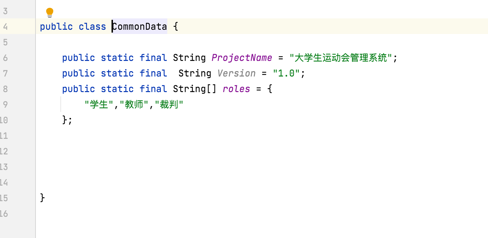
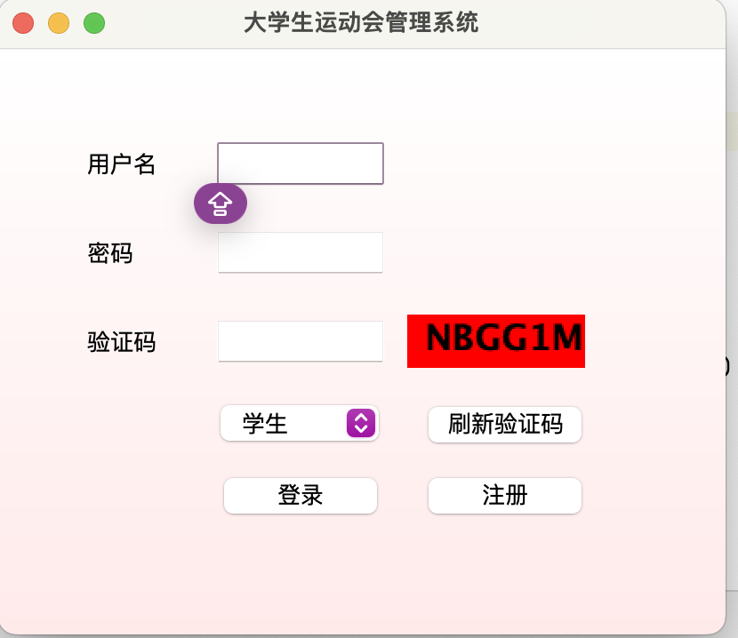
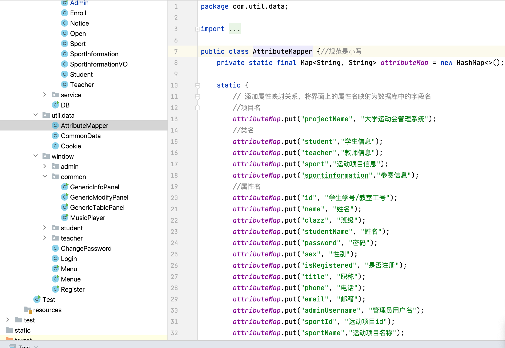
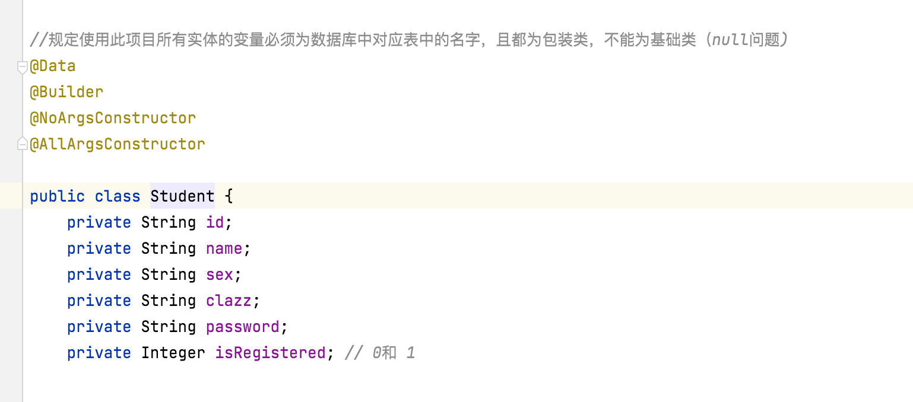
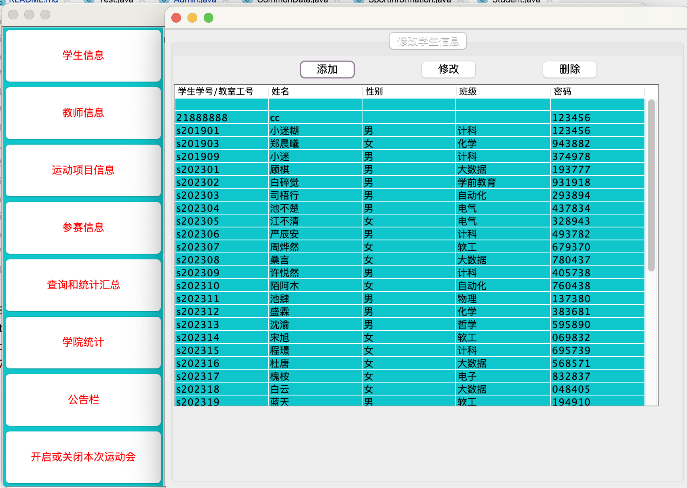
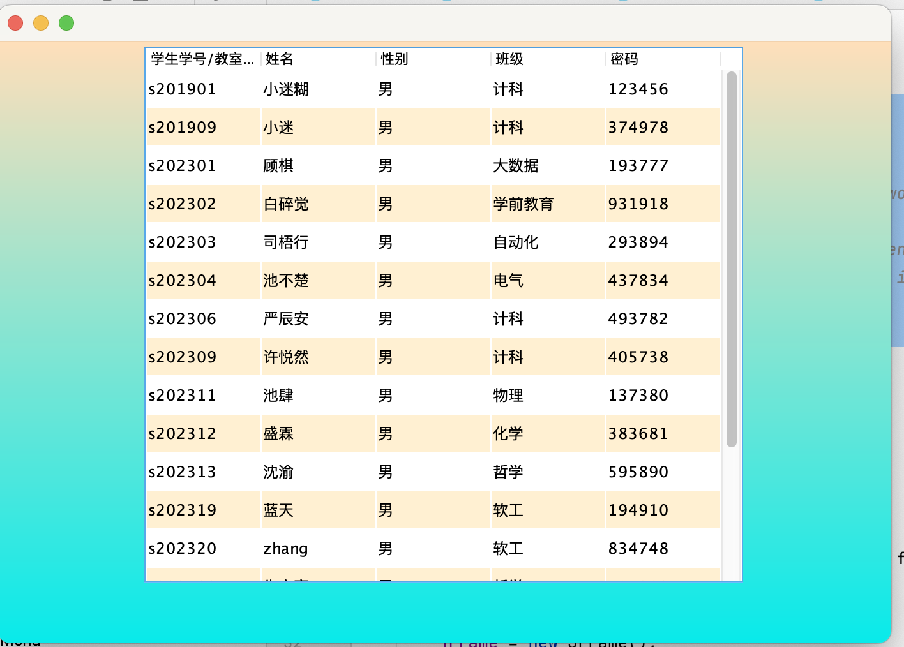
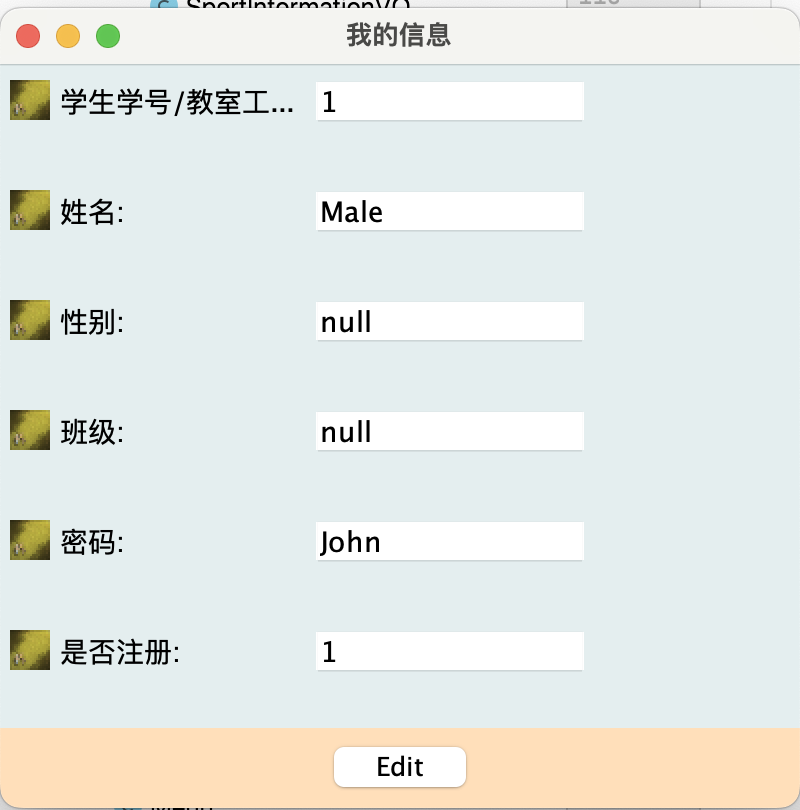
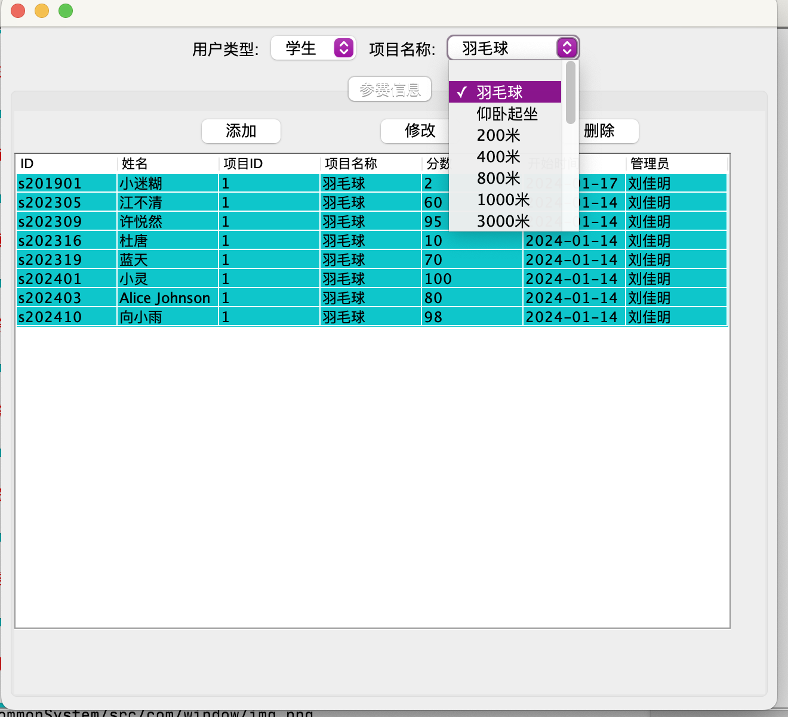
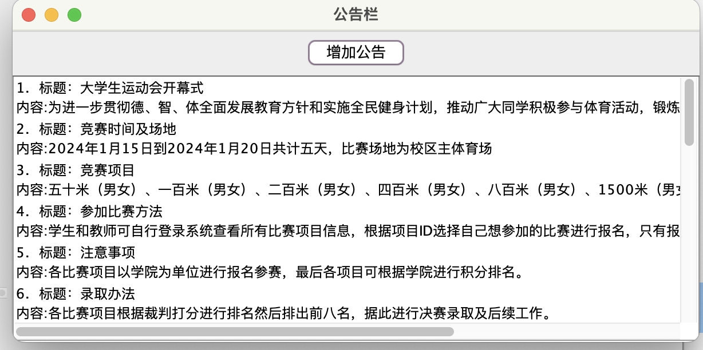

# README

# javaGUI_commonSystem

一个基于 javaswing的基本框架，增删改查都用了反射，可以快速搭建一个 javaswing的XX管理系统

## 功能

* 登录、注册
* 列表信息显示
* 个人信息展示
* 公告栏
* 信息修改
* ......

## 快速开发一个系统

1. 在 Common中修改 项目名称，以及角色

​​

​​

2. 写好映射关系：

​​

3. 实体类与数据库中字段对应关系

​​

‍

4. 信息显示以及更改功能使用

    传入显示的表格标题 heard(界面显示时会自动查找其中文映射），传入一个要显示的类（set好某一字段后即为要查找的限制条件）传入为空则返回全部

    ```java
     String[] heard = {"id", "name", "sex", "clazz", "password"};
     Gen<Student> modifyPanel = new Gen<>();
     Student student = new Student(); // Create an instance of Student (you might need to set some values)

     student.setSex("男");
    //显示所有性别位男性的学生信息
     modifyPanel.show(heard, student, "sex");
    //显示所有学生信息
    modifyPanel.show(heard, student, "");
    ```

​​

5. 通用列表使用方式

    ```java
    //通用列表，使用方式

    /*
    String[] heard = {"id", "name", "sex", "clazz", "password"};

            GenericTablePanel<Student> tablePanel = new GenericTablePanel<>();
            Student student = new Student(); // Create an instance of Student (you might need to set some values)
            student.setSex("男");
            tablePanel.show(heard, student, "sex");
    * */
    ```

​​

6. 通用个人信息展示

    ```java
            GenericInfoPanel<Student> infoPanel = new GenericInfoPanel<>();
            Student student = new Student("1", "John", "Male", 1);
            infoPanel.show(student);
    ```

​​

7. 其他界面

    ​​

​​

8......

## 系统设计

### 泛型与反射

```java
public static <T> boolean insert(T entity) throws SQLException {
        Connection connection = null;
        PreparedStatement preparedStatement = null;

        try {
            connection = getConn();
            // 获取实体类的所有字段
            Field[] fields = entity.getClass().getDeclaredFields();
            // 获取实体类的类名并转换为小写，和数据库中表名字对应
            String tableName = entity.getClass().getSimpleName().toLowerCase();
            // 构建SQL语句
            StringBuilder sql = new StringBuilder("INSERT INTO " + tableName + " (");
            StringBuilder values = new StringBuilder(") VALUES (");
            for (Field field : fields) {
                //传入类变量只有有值才能更新，获取有值的变量
                field.setAccessible(true); // 设置字段可访问
                Object value = field.get(entity);
                if (value != null) {
                    sql.append(field.getName()).append(",");
                    values.append("?,");
                }
            }

            // 移除末尾的逗号
            sql.deleteCharAt(sql.length() - 1);
            values.deleteCharAt(values.length() - 1);

            // 拼接最终的SQL语句
            sql.append(values).append(")");

            // 创建PreparedStatement并设置参数
            preparedStatement = connection.prepareStatement(sql.toString());

            int parameterIndex = 1;
            for (Field field : fields) {
                field.setAccessible(true); // 设置字段可访问
                Object value = field.get(entity);

                if (value != null) {
                    preparedStatement.setObject(parameterIndex++, value);
                }
            }
            // 执行插入操作
            if(preparedStatement.executeUpdate()!=0){
                return true;
            }
            return false;
        } catch (SQLException | IllegalAccessException e) {
            e.printStackTrace();
            // 输出SQL异常信息
            System.err.println("SQL Exception: " + e.getMessage());
            return false; // 返回插入失败的标志
        } finally {
            connection.close();
        }
    }
```

利用反射动态地获取实体类的字段信息，构建 SQL 语句

```java

    // 通用的 update 方法，传入的是实体以及字段名（根据该字段找数据）
    public static <T> boolean update(T entity, String fieldName) throws SQLException {
        Connection connection = null;
        PreparedStatement preparedStatement = null;

        try {
            connection = getConn();

                    // 获取实体类的所有字段
                    Field[] fields = entity.getClass().getDeclaredFields();

            // 获取实体类的类名并转换为小写
            String tableName = entity.getClass().getSimpleName().toLowerCase();

            // 构建SQL语句
            StringBuilder sql = new StringBuilder("UPDATE " + tableName + " SET ");

            for (Field field : fields) {
                field.setAccessible(true); // 设置字段可访问
                Object value = field.get(entity);

                if (value != null) {
                    sql.append(field.getName()).append("=?,");
                }
            }

            // 移除末尾的逗号
            sql.deleteCharAt(sql.length() - 1);

            // 添加 WHERE 子句
            sql.append(" WHERE ").append(fieldName).append("=?");

            // 创建PreparedStatement并设置参数
            preparedStatement = connection.prepareStatement(sql.toString());

            int parameterIndex = 1;
            for (Field field : fields) {
                field.setAccessible(true); // 设置字段可访问
                Object value = field.get(entity);

                if (value != null) {
                    preparedStatement.setObject(parameterIndex++, value);
                }
            }

            // 设置 WHERE 子句的参数
            Field targetField = entity.getClass().getDeclaredField(fieldName);
            targetField.setAccessible(true); // 设置字段可访问
            Object targetValue = targetField.get(entity);
            preparedStatement.setObject(parameterIndex, targetValue);

            // 执行更新操作
            if(preparedStatement.executeUpdate()!=0){
                return true;
            }
            return false;

        } catch (SQLException | IllegalAccessException | NoSuchFieldException e) {
            e.printStackTrace();
            // 输出SQL异常信息
            System.err.println("SQL Exception: " + e.getMessage());
            return false; // 返回插入失败的标志
        } finally {
            connection.close();
        }
    }

```

```java
 // 简化的 select 方法，传入类型实例，以及 where后的限制字段  select * from (entity的类名) where fieldName = (entity实例的fieldName值)返回传入类型的链表
    //若field == ""则返回表中所有记录
    public static <T> List<T> select(T entity, String fieldName) throws SQLException {
        Connection connection = null;
        PreparedStatement preparedStatement = null;
        ResultSet resultSet = null;

        try {
            connection = getConn();
            // 获取实体类的类名并转换为小写
            String tableName = entity.getClass().getSimpleName().toLowerCase();
            // 构建SQL语句
            String sql = "SELECT * FROM " + tableName;

            if (!fieldName.isEmpty()) {
                // If fieldName is not empty, add WHERE clause
                sql += " WHERE " + fieldName + "=?";
            }

            // 创建PreparedStatement并设置参数
            preparedStatement = connection.prepareStatement(sql);

            // If fieldName is not empty, set the parameter
            if (!fieldName.isEmpty()) {
                // 通过反射获取实体对象的字段值
                Field field = entity.getClass().getDeclaredField(fieldName);
                field.setAccessible(true); // 设置字段可访问
                Object value = field.get(entity);

                preparedStatement.setObject(1, value);
            }

            // 执行查询操作
            resultSet = preparedStatement.executeQuery();

            // 创建实体对象列表
            List<T> resultList = new ArrayList<>();

            // 获取查询结果并设置实体对象的属性
            while (resultSet.next()) {
                T resultEntity = (T) entity.getClass().getDeclaredConstructor().newInstance();
                Field[] fields = resultEntity.getClass().getDeclaredFields();
                for (Field resultField : fields) {
                    resultField.setAccessible(true); // 设置字段可访问
                    Object resultValue = resultSet.getObject(resultField.getName());
                    resultField.set(resultEntity, resultValue);
                }
                resultList.add(resultEntity);
            }

            return resultList;

        } catch (SQLException | IllegalAccessException | InstantiationException | NoSuchMethodException | NoSuchFieldException | InvocationTargetException e) {
            e.printStackTrace();
            // 输出异常信息
            System.err.println("Exception: " + e.getMessage());
            return new ArrayList<>(); // 返回空列表或其他标志
        } finally {
            connection.close();
        }
    }

```

```java

    // 通用的 delete 方法
    public static <T> boolean delete(T entity, String fieldName) throws SQLException {
        Connection connection = null;
        PreparedStatement preparedStatement = null;

        try {
            connection = getConn();// 获取数据库连接，这里是你的实现

            // 获取实体类的类名并转换为小写
            String tableName = entity.getClass().getSimpleName().toLowerCase();

            // 构建SQL语句
            System.out.println(tableName);
            String sql = "DELETE FROM " + tableName + " WHERE " + fieldName + "=?";

            // 创建PreparedStatement并设置参数
            preparedStatement = connection.prepareStatement(sql);

            // 通过反射获取实体对象的字段值
            Field field = entity.getClass().getDeclaredField(fieldName);
            field.setAccessible(true); // 设置字段可访问
            Object value = field.get(entity);
            System.out.println(value.toString());
            preparedStatement.setObject(1, value);

            int falg = preparedStatement.executeUpdate();
            System.out.println(falg);
            // 执行删除操作
            if(falg!=0){
                return true;
            }
            return false;

        } catch (SQLException | IllegalAccessException | NoSuchFieldException e) {
            e.printStackTrace();
            // 输出异常信息
            System.err.println("Exception: " + e.getMessage());
            return false; // 返回删除失败的标志
        } finally {
            connection.close();
        }
    }
```

```java
insertProjectButton.addActionListener(new ActionListener() {
    @SneakyThrows
    @Override
    public void actionPerformed(ActionEvent e) {
        // ... (Prompt user for input, create newValues array, and add new row to the model)

        // Insert into the database
        T entityToInsert;
        try {
            entityToInsert = (T) entity.getClass().getDeclaredConstructor().newInstance();
        } catch (InstantiationException | IllegalAccessException | InvocationTargetException | NoSuchMethodException ex) {
            ex.printStackTrace(); // Handle the exception appropriately
            return;
        }

        // Set values from newValues to the entity
        for (int i = 0; i < chineseHeard.length; i++) {
            setEntityProperty(entityToInsert, heard[i], newValues[i]);
        }

        // Insert into the database
        DB.insert(entityToInsert);
    }
});

```

```java
// 辅助方法：使用反射设置属性值
private void setEntityProperty(T entity, String propertyName, Object value) {
    try {
        // 假设 T 类型有一个用于该属性的 setter 方法（例如，setName()）
        // 通过反射找到实体对象的 setter 方法
        Method setterMethod = findSetterMethod(entity.getClass(), propertyName);

        // 如果找到了 setter 方法，则调用该方法设置属性值
        if (setterMethod != null) {
            setterMethod.invoke(entity, value);
        }
    } catch (IllegalAccessException | InvocationTargetException ex) {
        // 处理反射调用异常
        ex.printStackTrace(); // 在实际应用中，应该以适当的方式处理异常
    }
}
    // Helper method to find the setter method for a property
    private Method findSetterMethod(Class<?> clazz, String propertyName) {
        String setterMethodName = "set" + propertyName.substring(0, 1).toUpperCase() + propertyName.substring(1);
        Method[] methods = clazz.getMethods();
        for (Method method : methods) {
            if (method.getName().equals(setterMethodName) && method.getParameterCount() == 1) {
                return method;
            }
        }
        return null;
    }
```
